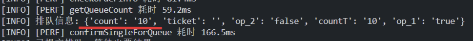

# 12306 抢票助手 (12306FairTicket)

这是一个面向 12306 开售瞬间的命令行抢票项目。它会在开售前完成登录、站点解析、乘车人准备和时间校准，并在目标时间前进入热身查询窗口，尽量让有效请求更早发出。项目的核心价值不在于夸大成功率，而在于把真正影响开售命中率的几个关键环节提前优化好：时间更准确、请求更及时、提交更直接。

**五一高峰实测视频**：[点击观看](https://m.bilibili.com/video/BV1i3ooBhEqn?buvid=XU38C873DE79A44D1842474F49BCB5F393FB3&from_spmid=main.space.0.0&is_story_h5=false&mid=erSk%2Fdcdn%2Fxv1k8awquvIg%3D%3D&p=1&plat_id=114&share_from=ugc&share_medium=android&share_plat=android&share_session_id=990cb775-daf9-4131-8c50-e1d2d4be8787&share_source=COPY&share_tag=s_i&spmid=united.player-video-detail.0.0&timestamp=1777170833&unique_k=R5jczv6&up_id=496056909)

## ✨ 项目最核心的优势

- **自动同步 12306 服务器时间，降低本地设备时钟偏差带来的不利影响。**
- **默认提前 `1.5s` 进入热身查询窗口，而不是在开售时刻才发出第一条请求。**
- **发现票源后直接进入提交流程，关键参数均已提前完成预处理。**
- **在节假日高峰期开售场景下，及时进入第一波有效提交。**

## 🚀 5 分钟入门

### 1. 进入项目目录并安装依赖

```powershell
cd project_root\12306FairTicket
pip install -r requirements.txt
```

### 2. 打开 `config.py`，先只改最常用的参数

优先修改下面这些参数，已经足够开始使用：

```python
FROM_STATION = "北京西"
TO_STATION = "郑州东"
TRAIN_DATE = "2026-05-01"

PASSENGER_NAMES = ["张三"]

SEAT_TYPES = ["二等座", "无座", "一等座"]
PREFERRED_TRAINS = ["G79", "G95"]
ONLY_PREFERRED_TRAINS = True

START_AT = "10:00:00"
STOP_AT = "10:05:00"
```

有几个规则需要优先确认：

- `FROM_STATION` / `TO_STATION` 必须写 **12306 标准站名**，最好具体到站。比如 `北京西`、`郑州东`、`上海虹桥`。如果你写 `"北京"`，默认表示 **北京站**，不是“北京市所有车站”。
- `PASSENGER_NAMES` 必须是 **当前 12306 账号里的常用乘车人姓名**，并且要和 12306 中完全一致。
- 本项目 **不会在配置里显式传身份证号和手机号**。扫码登录后，程序会从 12306 常用乘车人列表中读取所需信息，尽量避免把敏感信息直接写进配置文件。
- `PREFERRED_TRAINS` 是 **从左到右依次优先**。
- `SEAT_TYPES` 也是 **从左到右依次优先**。

### 3. 提前 3-4 分钟运行脚本

虽然程序默认只会提前 `1.5s` 进入热身查询窗口，但仍建议 **提前 3-4 分钟启动**，把下面这些准备动作都放在开售前完成：

- 同步 12306 服务器时间
- 加载站点编码
- 检查登录状态
- 生成二维码
- 等待手机扫码确认
- 拉取常用乘车人

运行命令：

```powershell
python main.py
```

### 4. 扫码登录

如果当前登录态失效，程序会把二维码保存到项目根目录下的：

```text
.runtime/login_qr.png
```

脚本启动后，直接打开项目根目录里的 `.runtime/login_qr.png`，然后使用 **12306 App** 扫码确认登录即可。

### 5. 观察日志并等待结果

启动后你会看到类似这样的流程：

- 已加载配置
- 已同步 12306 服务器时间
- 已选择乘车人
- 等待热身查询窗口
- 第 N 次查询余票
- 发现票源
- 开始提交订单
- 等待订单结果

如果日志中出现订单号，请尽快前往 12306 完成支付。

### 6. 只想检查配置，不想真的抢

```powershell
python main.py --validate-config
```

## 🧰 实用辅助命令

项目提供了几个不开抢、仅做检查/预览的命令，建议正式抢票前先跑一遍：

| 命令 | 作用 |
| --- | --- |
| `python main.py --validate-config` | 只校验配置格式与合法性，不联网、不登录 |
| `python main.py --check-stations` | 校验 `FROM_STATION` / `TO_STATION` 是否为有效站名，无效时给出相近站名提示；会顺带更新站点缓存 |
| `python main.py --list-passengers` | 登录后列出当前账号的**常用乘车人**（姓名 + 打码证件号），方便你正确填写 `PASSENGER_NAMES` |
| `python main.py --query-once` | 登录后只查询一次余票并打印各车次座席余票，便于提前确认票源与配置是否正确 |

推荐使用顺序：

```powershell
python main.py --validate-config    # 1. 确认配置合法
python main.py --check-stations     # 2. 确认站名有效
python main.py --list-passengers    # 3. 确认乘车人姓名正确
python main.py --query-once         # 4. 观察一次真实余票
python main.py                      # 5. 正式开抢
```

> 提示：`--list-passengers` 和 `--query-once` 需要扫码登录；`--validate-config` 与 `--check-stations` 不登录、不下单。

## ⚙️ `config.py` 参数总表

### 核心业务参数

| 参数 | 作用 | 常见写法 / 建议 |
| --- | --- | --- |
| `FROM_STATION` | 出发站，必须是 12306 标准站名 | `"北京西"`、`"开封北"`；写 `"北京"` 默认就是北京站 |
| `TO_STATION` | 到达站，必须是 12306 标准站名 | `"郑州东"`、`"上海虹桥"` |
| `TRAIN_DATE` | 乘车日期 | `"2026-05-05"` |
| `PASSENGER_NAMES` | 乘车人姓名列表，必须存在于当前 12306 账号的常用乘车人中 | `["张三"]`、`["张三", "李四"]` |
| `SEAT_TYPES` | 座席优先级，从左到右依次尝试 | `["二等座", "无座", "一等座"]` |
| `PREFERRED_TRAINS` | 车次优先级，从左到右依次尝试 | `["G1561", "G327"]` |
| `ONLY_PREFERRED_TRAINS` | 是否只尝试 `PREFERRED_TRAINS` 中的车次 | `True` 更可控；`False` 表示优先这些车次，但其他车次有票也可尝试 |
| `START_AT` | 开始抢票时间 | `"15:00:00"` 或 `"2026-05-05 15:00:00"` |
| `STOP_AT` | 停止抢票时间 | `"15:05:00"` 或 `"2026-05-05 15:05:00"` 或留空 |

> **关于时间格式**：`"HH:MM:SS"` 表示**当天**的某个时刻（适用于开售当天提前几分钟启动的场景）；如果你的运行时间会跨越午夜（例如前一天晚上启动、抢第二天的票），请务必使用完整格式 `"YYYY-MM-DD HH:MM:SS"`，否则程序会把 `START_AT` 当成当天已过的时间而立即开始。

### 查询与热身策略参数

| 参数 | 作用 | 常见写法 / 建议 |
| --- | --- | --- |
| `QUERY_INTERVAL_SECONDS` | 普通轮询间隔 | `0.6`、`1.0` |
| `MAX_RETRIES` | 最大查询轮数 | `1000` |
| `PRE_QUERY_SECONDS` | 在 `START_AT` 前多少秒进入热身查询窗口 | 当前默认 `1.5` |
| `HOT_QUERY_INTERVAL_SECONDS` | 热身窗口内的查票间隔 | 默认 `0.25` |
| `HOT_WINDOW_SECONDS` | `START_AT` 后继续保持热身频率的秒数 | 默认 `5.0` |
| `AUTO_SUBMIT` | 发现候选票后是否自动提交订单 | `True` 为自动抢；`False` 只查票不下单 |
| `CHOOSE_SEATS` | 选座字符串，不需要时留空 | 例如 `"1A"`；大多数场景留空更稳 |

### 请求与时间参数

| 参数 | 作用 | 常见写法 / 建议 |
| --- | --- | --- |
| `PURPOSE_CODES` | 票种查询参数 | 一般保持 `"ADULT"` |
| `REQUEST_TIMEOUT_SECONDS` | 单个 HTTP 请求超时 | 默认 `10` |
| `LOGIN_QR_TIMEOUT_SECONDS` | 二维码等待超时 | 默认 `180` |
| `LOGIN_QR_POLL_SECONDS` | 二维码状态轮询间隔 | 默认 `1.0` |
| `TIME_SYNC_SAMPLES` | 12306 时间同步采样次数 | 默认 `7` |
| `TIME_SYNC_MAX_RTT_SECONDS` | 可接受的最大 RTT 样本阈值 | 默认 `1.0` |
| `ORDER_WAIT_ATTEMPTS` | 提交订单后轮询结果的最大次数 | 常见为 `20` 到 `300` |
| `ORDER_WAIT_INTERVAL_SECONDS` | 结果轮询间隔 | 默认 `2.0` |

### 日志、缓存与本地文件参数

| 参数 | 作用 | 常见写法 / 建议 |
| --- | --- | --- |
| `STATION_CACHE_DAYS` | 站点编码缓存有效期（天） | 默认 `7` |
| `LOG_LEVEL` | 日志级别 | 一般用 `"INFO"` |
| `PERF_LOG` | 是否输出关键阶段毫秒级耗时日志 | 建议 `True` |
| `QR_CODE_FILE` | 登录二维码图片保存路径 | 默认 `.runtime/login_qr.png` |
| `SESSION_FILE` | 12306 登录态 cookie 保存路径 | 默认 `.runtime/session.cookies` |
| `STATION_CACHE_FILE` | 站点编码缓存文件路径 | 默认 `.runtime/stations.json` |
| `LOG_FILE` | 运行日志文件路径（控制台 + 文件双输出） | 默认 `.runtime/run.log` |

## 📌 本项目的优势

### 1. 基于服务器时间的时钟校准机制

手机时间偏慢、系统时间不准、网络延迟偏大，都会直接影响点击购票按钮的时机。12306 App 默认使用设备本地时间，这意味着**本地时钟稍慢的用户在开售瞬间天然处于不利位置，这种机制本身并不公平**。


本项目会自动做三件事：

1. 向 12306 发起多次时间采样；
2. 选择 RTT 更低的样本估算服务器时间偏移；
3. 用单调时钟维护等待过程，尽量减少系统时间跳变影响。

### 2. 面向开售瞬间的提前热身查询策略

当前默认配置：

```python
PRE_QUERY_SECONDS = 1.5
HOT_QUERY_INTERVAL_SECONDS = 0.25
HOT_WINDOW_SECONDS = 5.0
```

这意味着：

- 程序不会在 `START_AT` 那一刻才发出第一条查票请求；
- 程序会把“请求本身需要时间”这件事纳入考虑；
- 在目标时间前后，用更高频率轮询，尽量更早拿到可提交票源。

### 3. 提交链路的前置准备与本地耗时压缩

程序在热身前就会完成：

- 登录状态检查
- 二维码生成
- 常用乘车人读取
- 站点编码缓存
- 座席优先级解析
- 不同座席编码对应的提交字符串预生成

这会直接缩短“发现票源 -> 发起提交”的本地耗时。

### 4. 高峰期场景下的实测表现与适用价值

节假日尤其是热门短途，真正决定结果的往往不是“是否手动点击”，而是“是否足够早看到票”“是否足够快把请求送出去”“是否把时间消耗在准备动作上”。

按 `2026.04.20` 的五一抢票实测，多次运行本项目时，提交后的队列位置都进入前 10 名。它不承诺不切实际的成功率，但对于高峰期开售瞬间的时间利用效率，确实有直接帮助。



## ✅ 注意事项

### 1. 出现“排队中，预计等待 -100 秒”，通常可以视为已经进入 12306 受理流程

在本项目实测里，最后出现下面这类日志时，通常说明这次提交已经被 12306 正常受理：

```text
排队中，预计等待 -100 秒
```

这时可以直接前往手机端 **12306 -> 我的 -> 我的订单 -> 待支付** 查看进展。

### 2. 节假日高峰期，速度只是前提，最终是否出票仍取决于 12306 放票

热门节假日、热门短途这两种场景，经常会出现“提交已经很靠前，但系统实际放票仍然很少”的情况。无论是手动抢票还是脚本抢票，最后能否形成订单，仍然受 12306 放票节奏和配额影响。

更现实的理解是：

- 这个项目负责把时间校准、热身查询和提交链路尽量做到更靠前；
- 12306 最终给不给票，仍然不是脚本自己能决定的。

如果长时间没有出票，或者日志里明确提示余票不足，更实际的建议是：**尽快候补，不要长时间空等。**

### 3. 不要把 `.runtime` 目录发给别人

`.runtime` 里通常会包含：

- `login_qr.png`
- `session.cookies`
- `stations.json`

其中 `session.cookies` 可能代表你的登录态，不建议分享、上传或提交。

### 4. 建议提前运行，不要在开售前几十秒才启动

虽然程序默认会提前 `1.5s` 热身查票，但这并不意味着可以在开售前几秒才启动。更推荐的做法是：**至少提前 3-4 分钟运行**，把扫码、登录、站点、乘车人准备都提前完成，只把最后的时间点留给查票和提交。

### 5. 本项目的测试时间

当前仓库内这套流程 **于 `2026.06.04` 实测可用**。  
12306 网页端接口随时可能调整，如果未来某天突然失效，优先排查接口字段、隐藏参数、登录流程和返回结构是否发生变化。

## 🔍 抢票原理说明

如果你想按代码真实执行顺序理解这个项目，而不是只看怎么用，请看这份单独文档：

- [docs/抢票原理说明.md](docs/抢票原理说明.md)

这份文档会结合 `main.py`、`ticket_app/configuration.py`、`ticket_app/client.py`、`ticket_app/runner.py` 等代码，按“启动 -> 校时 -> 登录 -> 热身 -> 查票 -> 提交 -> 等待结果”的顺序，说明整个执行链路。

## 💻 常用命令

安装依赖：

```powershell
pip install -r requirements.txt
```

校验配置：

```powershell
python main.py --validate-config
```

正常抢票：

```powershell
python main.py
```

使用其他配置文件：

```powershell
python main.py --config my_config.py
```

## 📝 最后

这个项目最适合做的事，是把开售瞬间真正会拖后腿的细节提前处理掉：时间更准确、请求更及时、提交更直接。高峰期里，能够稳定进入第一波有效提交，本身就有明确价值；如果系统最终没有给票，也建议尽快转入候补。
